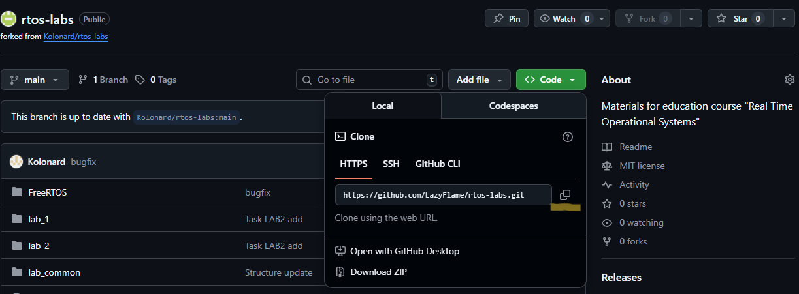
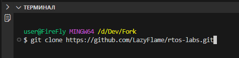

# Задания и материалы для лабораторных работ по дисциплине "Операционные систепмы реального времени"
---

## Инструкция по работе с репозиторием
#### (Fork → Clone → Branch → Commit → Pull Request)
Для выполнения задания вам нужно сделать форк репозитория, внести изменения и отправить Pull Request на проверку.
---

### Fork репозитория


### Клонирование своего форка на компьютер






### Создание новой ветки для задания

в терминал приложжения из которого вы работаете введите git checkout -b homework-<название ветки>. 


Эта команда создаёт новую ветку(git checkout) и переключает на неё(-b). [Правила создания веток из официальной документации Git](https://docs.github.com/ru/get-started/using-git/dealing-with-special-characters-in-branch-and-tag-names?utm_source=chatgpt.com)

### Внесите изменения и сохраните их
После редактирования файлов введите в терминал:
```bash
git add .
git commit -m "Выполнено задание Иванов"
```

### Отправить ветку на GitHub

```bash
git push origin <название ветки>
```

### Создаybt Pull Request (PR)
- Откройте ваш репозиторий на GitHub.

- Нажмите вкладку Pull Requests.

- Нажмите New Pull Request.

- Сравните ветки (Compare across forks, если нужно).

- Убедитесь, что:
    base repository — репозиторий преподавателя,
    compare — ваша ветка homework-ivanov.
- Нажмите Create Pull Request.
- Напишите комментарий при необходимости и отправьте PR.

## Правила оформления
- Имя ветки должно быть формата homework-фамилия
- Комментарии коммитов должны быть понятными
- Pull Request должен содержать только ваши изменения