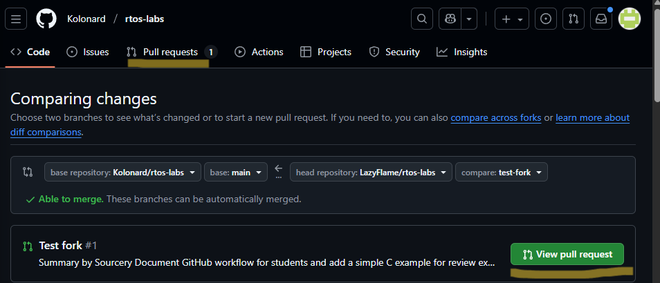
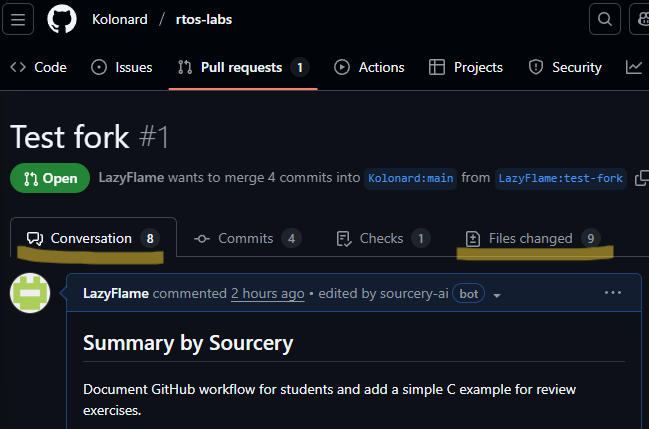

# Задания и материалы для лабораторных работ по дисциплине "Операционные системы реального времени"

---

## Инструкция по работе с репозиторием
*(Fork → Clone → Branch → Commit → Pull Request)*

Для выполнения задания вам нужно сделать форк репозитория, внести изменения и отправить Pull Request на проверку.

---

# Правила оформления
- Имя ветки должно быть формата homework-имя-фамилия-группа
- Комментарии коммитов должны быть понятными
- Pull Request должен содержать только ваши изменения

---

## Fork репозитория

В репозитории в правом верхнем углу нажмите кнопку **Fork**


*Кнопка Fork*

Выберите свой аккаунт GitHub и нажмите **Create fork**,  у вас создастся копия репозитория.


*Пример создания форка*

---

## Клонирование своего форка на компьютер

В своём форке нажмите **<> Code** и скопируйте ссылку на репозиторий.


*Кнопка <> Code*

В терминале вашего приложения введите:

```bash
git clone <скопированная_ссылка>git clone <скопированная сыылка>
```


*Пример git clone*

Перейдите в директорию проекта:

```bash
cd <имя_репозитория>
```


*Пример директории*

---

## Создание новой ветки для задания

В терминале введите:

```bash
git checkout -b homework-<имя-фамилия-номер группы>.
```


*Пример создания ветки*

Эта команда создаёт новую ветку (git checkout) и переключает на неё (-b).
 [Правила создания веток (Git)](https://docs.github.com/ru/get-started/using-git/dealing-with-special-characters-in-branch-and-tag-names?utm_source=chatgpt.com)

---

## Внесите изменения и сохраните их

После редактирования файлов введите в терминал:

```bash
git add . # добавляет изменения
git commit -m "ваш текст" #фиксиреет изменения
```

### Отправите ветку на GitHub

```bash
git push origin <название ветки> # отправляет изменения в указанную ветку в гите
```

Отследить запущенные изменения в своем репозитории вы можете, нажав на **main** и переключившись на ветку, в которой вы вели разработку.


*Переключение между ветками*

---

## Создание Pull Request (PR)

- Откройте ваш репозиторий на GitHub.
- Нажмите на вкладку *Pull Requests*.


*Вкладка Pull Requests*

- Нажмите га кнопку **New pull request**.

- Убедитесь, что:
    - base repository — репозиторий преподавателя,
    - compare — ваша ветка.


*Пример Pull Requests*

- Нажмите **Create Pull request**.
- Напишите комментарий при необходимости и сново нажмите **Create Pull request**

---

## Ревью

На этом этапе вы можете посмотреть состояние ревью вашего кода.

Для этого зайдите в свой репозиторий проекта и убедитесь, что находитесь в своей ветке.

Вы можете увидеть сообщение *This branch is ... commits ahead of Kolonard/rtos-labs:main.* (если этого сообщения нет, проверьте, что Pull request проведен корректно или находитесь ли вы в нужной ветке).

Для перехода в Pull request нажмите **Contribute**, в сплывшем окне нажмите **Open pull request**


*Переход в Pull request*

В открывшемся окне вы можете увидеть ваши изменения в коде. Для просмотра комментариев преподавателя либо перейдите во вкладку Pull request -> ваш пул реквест, на который вы ждете ревью, либо нажмите на кнопку **View pull request**



*Переход к ревью*

Посмотреть правки, оставленные преподавателем, вы можете посмотреть как в открывшемся окне, так и перейти во вкладку **Files changed**, где расположен весь код, отправленный вами.



*Вкладки с правками*

Если преподаватель оставил вам правки, то вы можете, ознакомившись с ними, при необходимости, написать свой вопрос.

Важно! Если вы оставляете комментарии под правками преподавателя из вкладки *Files changed*, обязательно нажмите на кнопку **Finish your review**, иначе ваш вопрос не опубликуется и преподаватель его не увидит.


*Вопрос из вкладки Files changed*